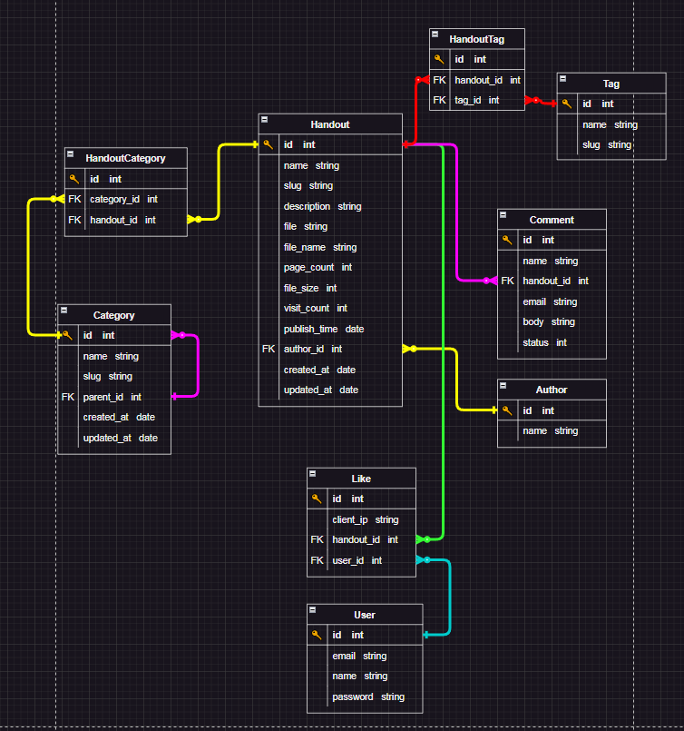

<div align="center">
<h1 align="center">Sample Project for internship course at Off_Chanel Company</h1>
</div>

# Guideline
- [Guideline](#guideline)
- [ER Diagram](#er-diagram)
- [How to use?](#how-to-use)
  - [Clone the repo](#clone-the-repo)
  - [Use Docker](#use-docker)

# ER Diagram
<p align="center">

</p>

# How to use?
First we use the LTS version of Django (Django==4.2 in 2024) to create the project base on [Django Supported version](https://www.djangoproject.com/download/). We suggest you to creat [virtual environment](https://docs.python.org/3/library/venv.html) or you can ignore it.

## Clone the repo
Clone this repo anywhere you want and move into the directory:
```bash
git clone https://github.com/handout-ir/backend_malekian
```

## Use Docker
we use [Docker](https://www.docker.com/) ,[PostgreSql](https://www.postgresql.org/) and [django-jalali](https://pypi.org/project/django-jalali/) for our project, if you already have docker and postgreSql installed just go to ```backend``` directory by cmd and simple run the command:

```bash
docker-compose up --build
```
this will be create image and container for you and you can go to ```http://127.0.0.1:8000/``` to see the result...
